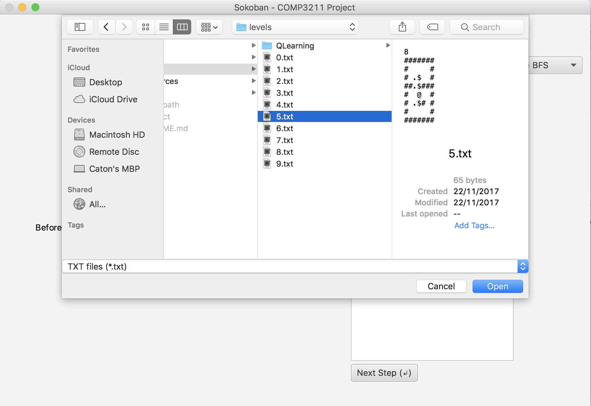
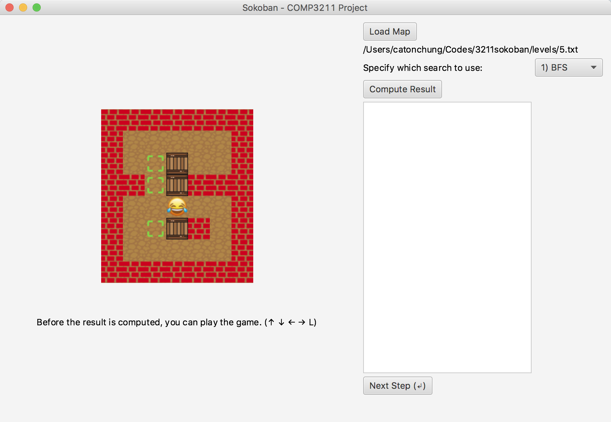
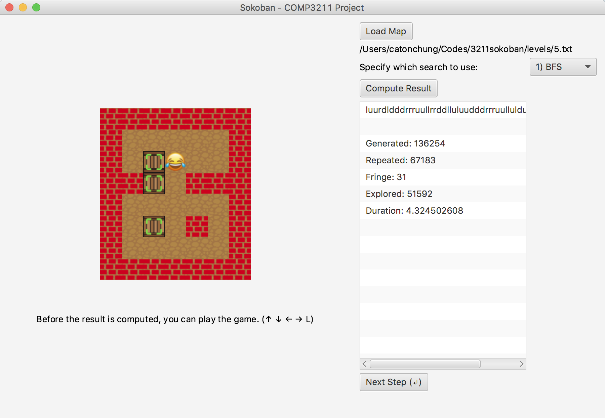
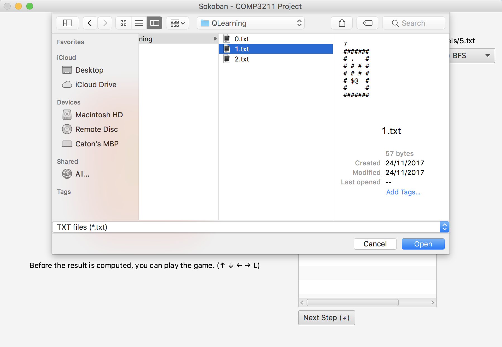
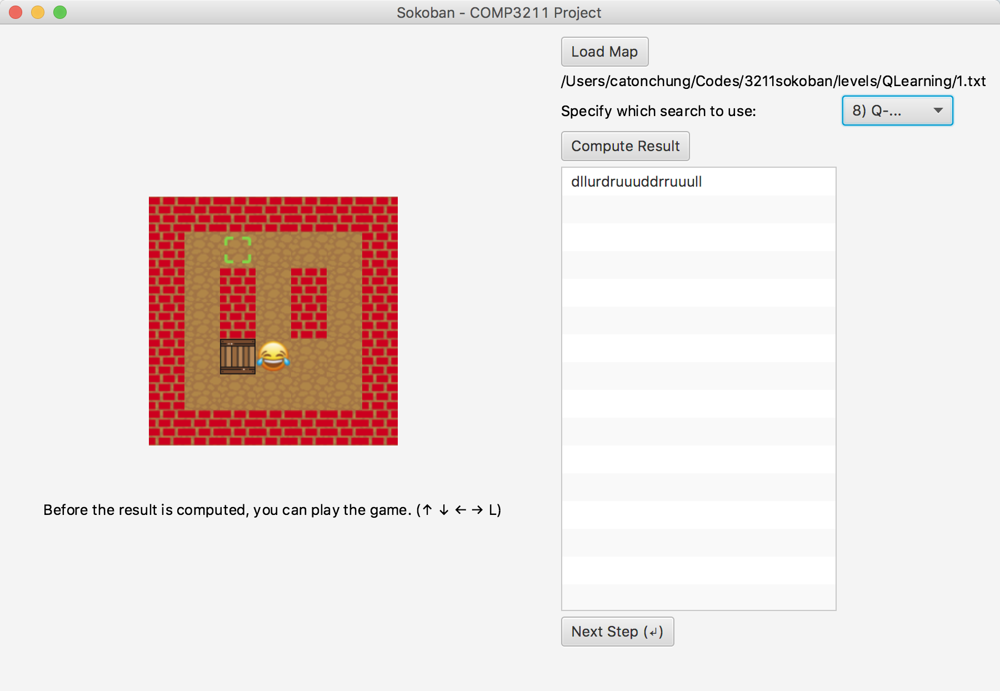
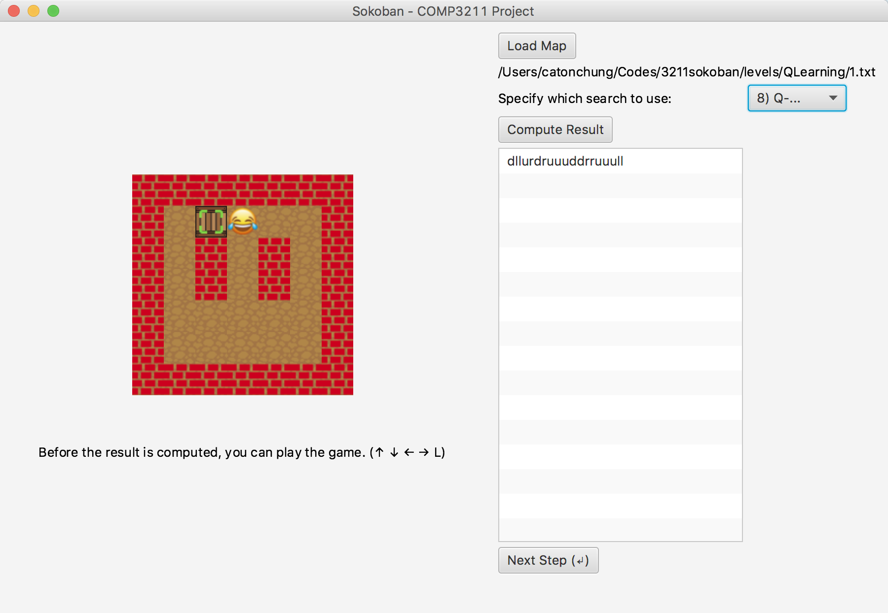

# Sokoban AI Solver (HKUST COMP3211 Group 6)

## Group members
| Name         	| Student ID   	| 
| ------------- 	|:-------------:	|
| GAO, Huaxuan  	|  20328408     	|
| HUANG, Xuhua  	|  20329347     	|
| LIU, Shuyue   	|  20329256     	|
| WANG, Guanzhi 	|  20329604		|
| ZHONG, Zixuan	|  20328800		|

## Set up

### 1) clone this project

```bash
$ git clone https://github.com/XUHUAKing/sokoban-qlearning.git
```
### 2) launch the GUI

```bash
$ cd AI_Sokoban/bin
$ java GUI 
```

## Search Algorithms


### 1) Load the map

click on the `Load Map` button and choose `/levels/5.txt`.



Before the result is computed, you can play the game. (↑ ↓ ← → L)

### 2) Compute the result

Choose a search algorithm and click on the button `Compute Result`



### 3) Move the agent

Keep pressing on the `enter(return)` button to make the agent move according to the result.



## Q-Learning

### 1) Load the map

click on the `Load Map` button and choose `/levels/QLearning/1.txt`.



Before the result is computed, you can play the game. (↑ ↓ ← → L)

### 2) Compute the result

Choose `8) Q-Learning` and click on the button `Compute Result`



### 3) Move the agent

Keep pressing on the `enter(return)` button to make the agent move according to the result.



## Java doc

[default package](http://hgaoab.student.ust.hk/javadoc3211/docs/package-summary.html)

[reinforcement_learning package](http://hgaoab.student.ust.hk/javadoc3211/reinforcement/reinforcement_learning/package-summary.html)

## Credit

[wfalkwallace/AI/tree/master/hw2](https://github.com/wfalkwallace/AI/tree/master/hw2)

